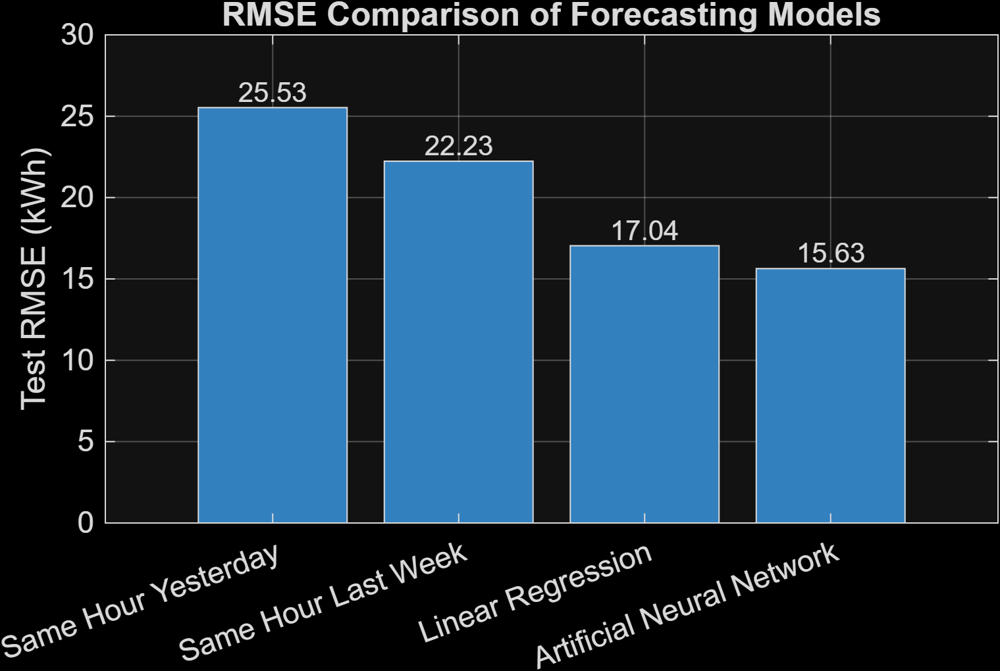
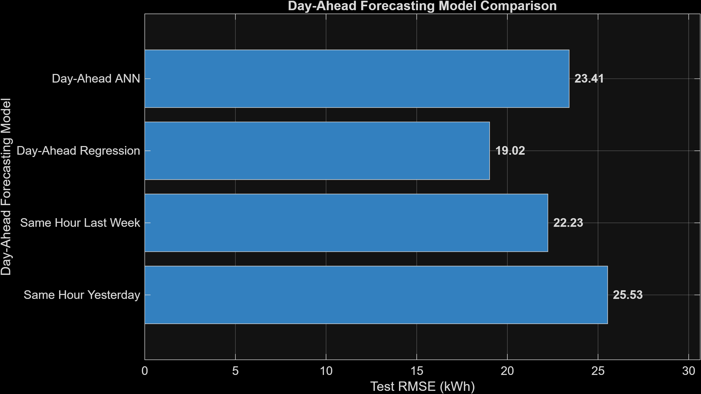
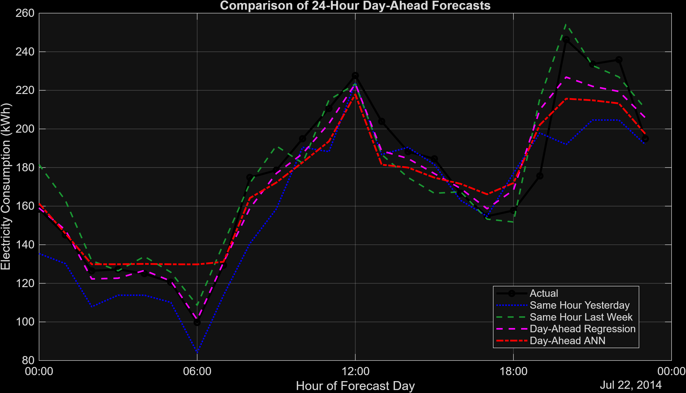

# Electricity Consumption Forecasting Using MATLAB

An end-to-end MATLAB project for one-hour-ahead and 24-hour day-ahead electricity consumption forecasting using historical baselines, multiple linear regression, and feedforward artificial neural networks.

## Project Overview

Electrical demand forecasting supports generation scheduling, economic operation, reserve planning, demand response, and renewable-energy integration.

This project investigates whether machine-learning models can predict hourly electricity consumption more accurately than simple historical forecasts. Two forecasting problems are evaluated:

* One-hour-ahead forecasting
* 24-hour day-ahead forecasting

All models are evaluated using chronological training, validation, and test partitions to prevent future-data leakage.

## Dataset

The project uses `electricityclient.mat`, a preprocessed subset of the UCI Electricity Load Diagrams dataset distributed with an official MathWorks forecasting example.

Dataset characteristics:

* 26,304 hourly observations
* Period: 2012–2014
* Response variable: hourly electricity consumption
* Unit: kWh
* Consumer: sixth client from the original dataset

The original UCI dataset contains electricity-consumption measurements for 370 clients recorded every 15 minutes from 2011 to 2014.

The dataset is not included in this repository. It can be obtained through the MathWorks example:

[Autoregressive Time Series Prediction Using Deep Learning](https://www.mathworks.com/help/deeplearning/ug/autoregressive-time-series-prediction-with-deep-learning.html)

## Methodology

The forecasting workflow consists of:

1. Loading and inspecting hourly electricity data
2. Checking missing values, negative readings, duplicate timestamps, and irregular intervals
3. Visualizing long-term, daily, and weekly consumption patterns
4. Constructing lagged-consumption and calendar features
5. Splitting data chronologically into training, validation, and testing sets
6. Training historical baseline, regression, and ANN models
7. Evaluating forecasts using MAE, RMSE, and MAPE
8. Examining forecast bias, error distributions, and exceptional errors

## Input Features

### One-hour-ahead model

The one-hour model uses:

* Consumption one hour earlier: `Lag1`
* Same hour yesterday: `Lag24`
* Same hour last week: `Lag168`
* Hour of day
* Day of week
* Month
* Weekend indicator

The forecasting relationship is:

```text
[ Lag1, Lag24, Lag168, Hour, Weekday, Month, Weekend ]
                              ↓
                 Current-hour consumption
```

### Day-ahead model

The day-ahead model excludes `Lag1` because actual observations from the forecast day are not available before that day begins.

Its inputs are:

```text
[ Lag24, Lag168, Hour, Weekday, Month, Weekend ]
                              ↓
                  Target-hour consumption
```

## Models Compared

* Same hour yesterday
* Same hour last week
* Multiple linear regression
* Feedforward artificial neural network

The ANN contains:

```text
Input layer → 20 hidden neurons → 10 hidden neurons → 1 output
```

Input normalization parameters are calculated using training data only. Validation-based early stopping is used to reduce overfitting.

## One-Hour-Ahead Results

| Model                     | Test RMSE (kWh) |
| ------------------------- | --------------: |
| Same hour yesterday       |          25.529 |
| Same hour last week       |          22.234 |
| Linear regression         |          17.040 |
| Artificial neural network |      **15.634** |

The ANN produced the lowest one-hour-ahead RMSE.

Additional ANN results:

* MAE: 11.121 kWh
* RMSE: 15.634 kWh
* MAPE: 5.98%
* Mean forecast error: −0.397 kWh



## Day-Ahead Results

| Model                     |  MAE (kWh) | RMSE (kWh) |      MAPE |
| ------------------------- | ---------: | ---------: | --------: |
| Same hour yesterday       |     18.167 |     25.529 |     9.93% |
| Same hour last week       |     15.920 |     22.234 |     8.43% |
| **Linear regression**     | **13.687** | **19.021** | **7.44%** |
| Artificial neural network |     16.659 |     23.409 |     9.37% |

Linear regression achieved the best day-ahead performance and reduced RMSE by approximately 14.45% relative to the strongest historical baseline.



## Example 24-Hour Forecast

The following graph compares actual electricity consumption with the historical baselines, regression forecast, and ANN forecast for one complete test day.



## Key Findings

* Daily and weekly historical consumption patterns provide useful forecasting information.
* The one-hour ANN performed best when the latest one-hour measurement was available.
* Linear regression generalized better for day-ahead forecasting.
* A more complex model was not automatically more accurate.
* Model performance depended on forecast horizon and available predictors.
* Chronological testing was essential for realistic evaluation.

## Repository Structure

```text
matlab-electricity-load-forecasting/
├── README.md
├── code/
│   ├── load_forecasting_project.m
│   └── load_forecasting_project.mlx
├── figures/
│   ├── complete_dataset.png
│   ├── two_week_consumption.png
│   ├── chronological_data_split.png
│   ├── actual_vs_ann.png
│   ├── model_rmse_comparison.png
│   ├── ann_error_histogram.png
│   ├── day_ahead_model_comparison.png
│   └── all_day_ahead_forecasts.png
└── results/
    ├── model_comparison.csv
    └── day_ahead_model_comparison.csv
```

## MATLAB Requirements

The project was developed using:

* MATLAB R2026a
* Statistics and Machine Learning Toolbox
* Deep Learning Toolbox

The project does not require Econometrics Toolbox. Lagged variables are created using standard MATLAB indexing.

## How to Run

1. Download or clone this repository.
2. Obtain `electricityclient.mat` from the official MathWorks example.
3. Create a `data` folder in the project root.
4. Place the dataset at:

```text
data/electricityclient.mat
```

5. Open:

```text
code/load_forecasting_project.mlx
```

6. Run the Live Script sections in numerical order.
7. Review the generated figures and CSV result tables.

## Evaluation Metrics

The models are evaluated using:

* Mean Absolute Error (MAE)
* Root Mean Squared Error (RMSE)
* Mean Absolute Percentage Error (MAPE)

Lower metric values indicate better forecasting performance.

## Limitations

* The dataset represents one electricity consumer rather than an entire power grid.
* Temperature, humidity, electricity price, occupancy, and holidays are not included.
* Day-ahead performance may improve with weather and event predictors.
* Results are specific to this dataset, feature set, model configuration, and chronological test period.

## Future Work

* Incorporate temperature and humidity
* Include holidays and special-event indicators
* Test LSTM and other sequence models
* Tune ANN hyperparameters
* Add prediction intervals
* Evaluate peak-demand forecasting
* Apply the workflow to feeder or regional load measured in MW
* Build an interactive MATLAB App Designer dashboard

## Technical Conclusion

For this dataset, the ANN performed best for one-hour-ahead forecasting, while linear regression performed best for day-ahead forecasting. The experiment demonstrates that greater model complexity does not necessarily provide better generalization and that forecasting models must be compared fairly on unseen chronological data.

## Author

Manita
Final-Year Electrical Engineering Student
